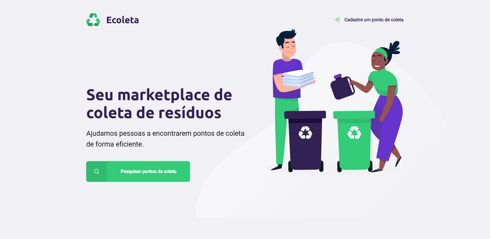
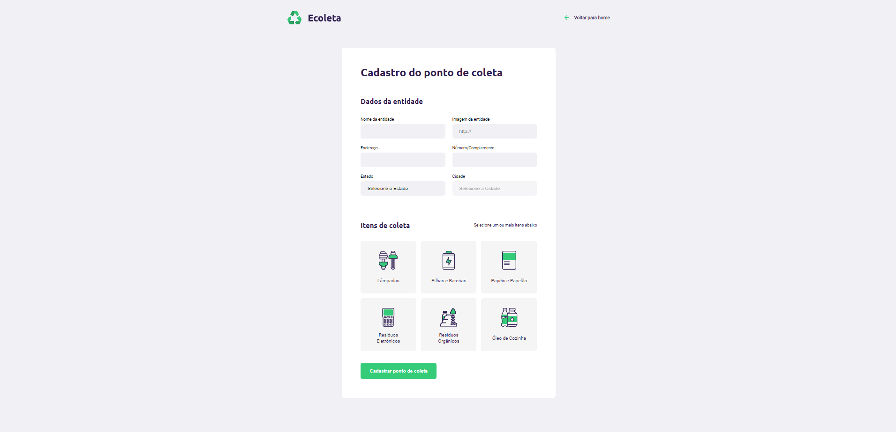
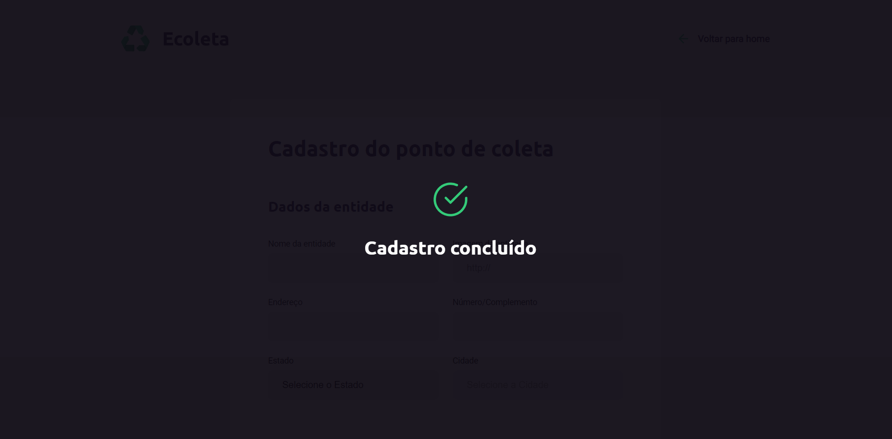
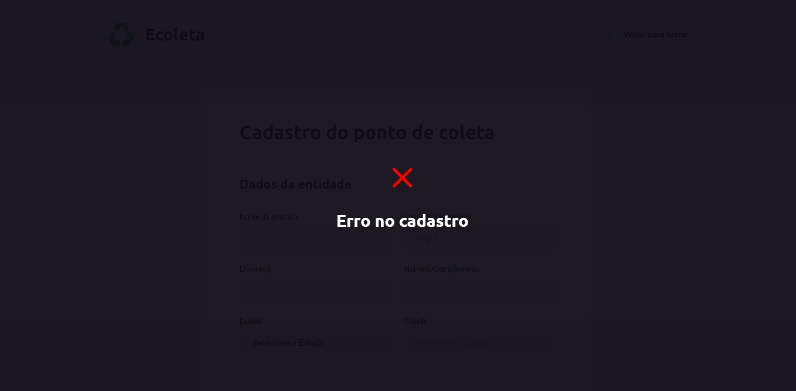
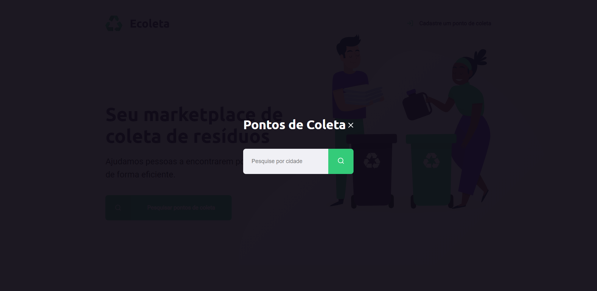
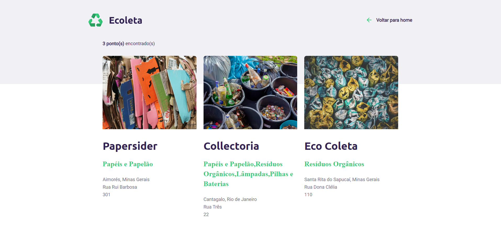

# next-level-week
Repository dedicated to Rocketseat's Next Level Week activities

--------------------------------------------------------------------

Next Level Week was a week of classes taught by Rocketseat, in which the students were able to learn a lot and start their journey in web development. 

We had five days of intense coding with the aim of build an application that simulates a marketplace for waste collection. For this purpose, we learned about html, css and javascript for do the frontend, besides node.js and sql to construct the backend. 

It was a great experience, mainly for who are starting at web development. Below you can see the images of the final results.

--------------------------------------------------------------------

### Home page

### Collection point registration page

### Confirmation if everything's ok

### Message if an error occurs

### Page of search

### The results of the search

